<div align="center">
    <a href="https://github.com/wafflestudio21-5/team2-android">
    
    </a>
    <h2 align="center">바니바니</h2>
    <p align="center">
    <h4>Wafflestudio 21.5기 루키 Team 2 토이프로젝트: 당근마켓 클론코딩</h4>
    <div style="padding: 1rem">
    
     <br/>
    
    
    
    
     <br/>
    
    
    </div>
    </p>
</div>

### 목차

I. [주요 화면 및 기능](#i-주요-화면-및-기능)
1. [로그인/회원가입](#1-로그인--회원가입)
2. [물품 게시글](#2-물품-게시글)
3. [동네생활(커뮤니티)](#3-동네생활-커뮤니티)
4. [채팅](#4-채팅)
5. [나의 당근](#5-나의-당근)

II. [서비스 아키텍처](#ii-서비스-아키텍처)
1. [서비스 구조](#1-서비스-구조)
2. [ERD](#2-erd)

III. [협업 방식](#iii-협업-방식)
1. [Notion](#1-notion)
2. [Git](#2-git)
3. [Slack](#3-slack)


### Github 저장소

- [Android](https://github.com/wafflestudio21-5/team2-android)
- [Server (Spring)](https://github.com/wafflestudio21-5/team2-server)

### 팀원 및 역할

| 클라이언트(Android) | 역할 |
| --- | --- |
| 김도연 | 에러 핸들링, 나의 당근 |
| 손영준 | 채팅, 로그인/회원가입 |
| 안시영 | 게시글 목록/조회, 커뮤니티, 검색 |

| 백엔드 (Spring) | 역할 |
| --- | --- |
| 심영인 | 사용자(Spring Security, JWT), 지역, 경매 |
| 이한나 | 동네생활(커뮤니티) |
| 임찬영 | 물품 게시글, 지역 정보 처리, 이미지 업로드(S3), 캐싱 |
| 임혜진 | 채팅(WebSocket) |

# I. 주요 화면 및 기능

## 1. 로그인 / 회원가입

### 1.1. 일반 로그인 / 회원가입 화면

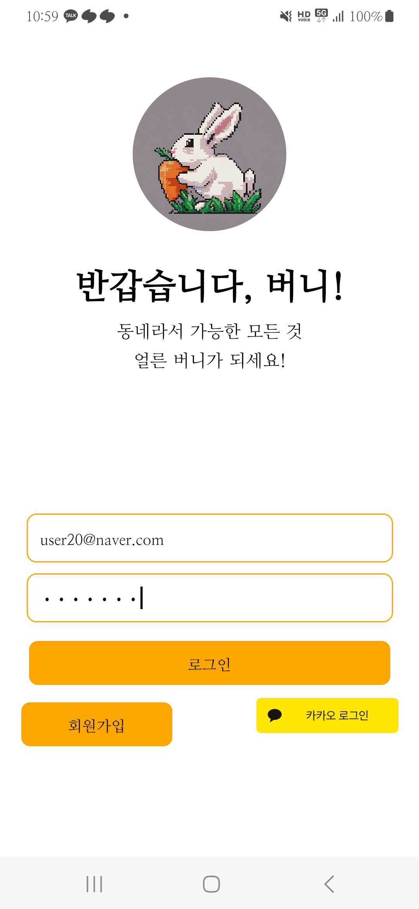

- 이메일, 비밀번호로 로그인
- 일반 회원가입, 카카오 로그인 화면으로 이동 가능

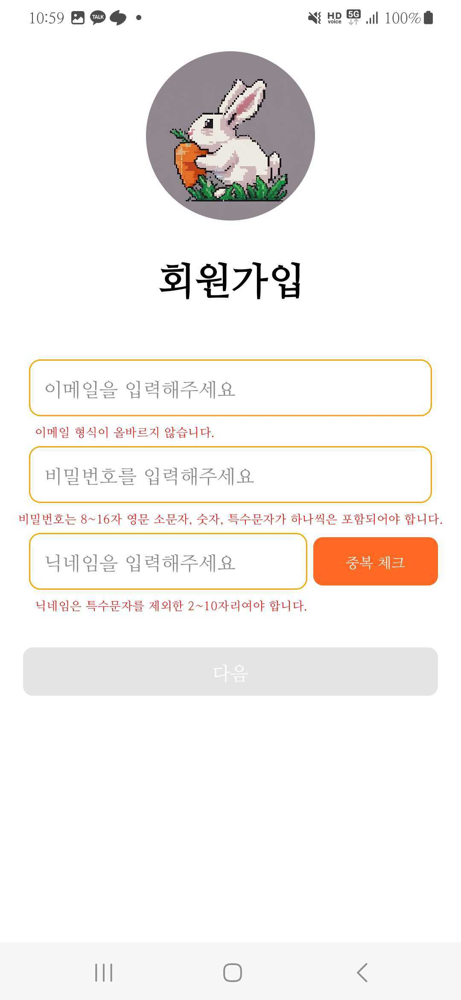

- 이메일, 비밀번호, 닉네임을 입력해 회원가입
- 이메일, 비밀번호, 닉네임 형식 확인 기능
- 닉네임 중복 확인 기능

### 1.2. 사용자별 지역 설정 화면 (행정동 단위)

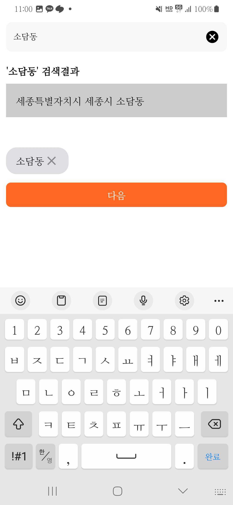

- 동 단위로 검색 가능

### 1.3. 지역 및 거리 범위 설정

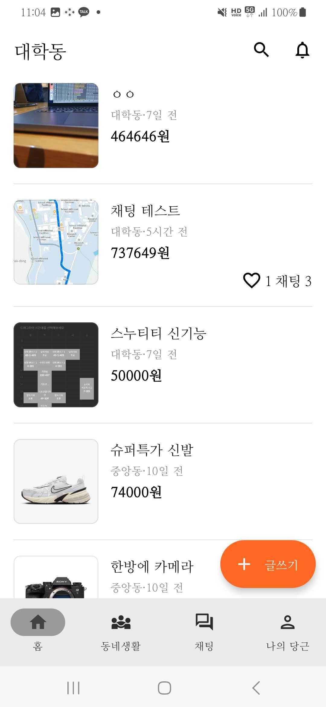

- 상단의 OO동 (ex. 대학동) 클릭
    
    → 지역 및 거리 범위 설정 화면으로 이동

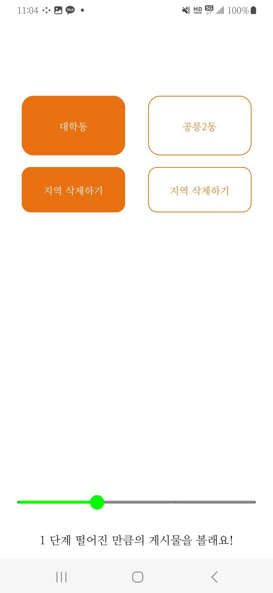

- 지역 선택 / 거리 범위 설정 기능

## 2. 물품 게시글

### 2.1. 물품 게시글 목록 / 상세 화면

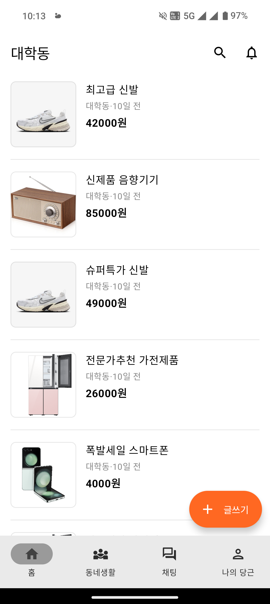
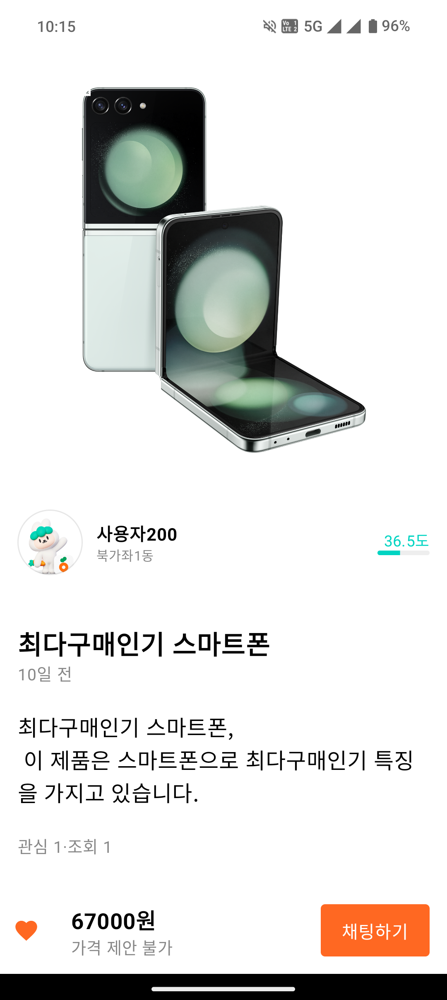

- 채팅하기 버튼 클릭
    
    → 판매자와의 채팅 화면으로 이동
    
- 관심 물품 등록/취소 기능

### 2.2. 물품 게시글 작성 화면

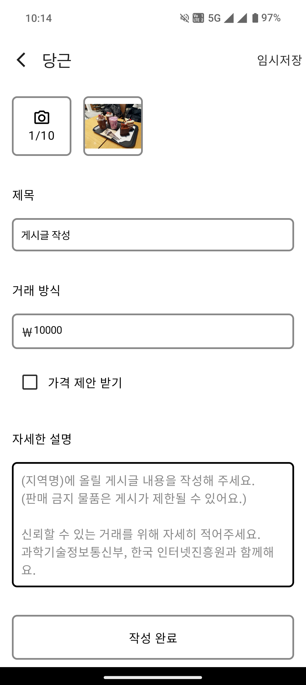

- 사진 최대 10개 등록 가능
- 제목, 희망 거래 금액, 설명 작성
- 가격 제안 여부 설정 가능

## 3. 동네생활 (커뮤니티)

### 3.1. 동네생활 게시글 목록 / 상세 화면

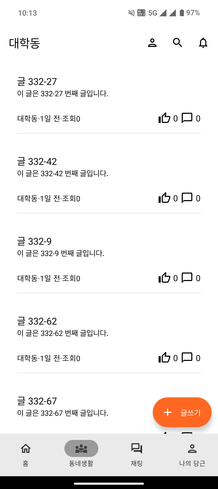
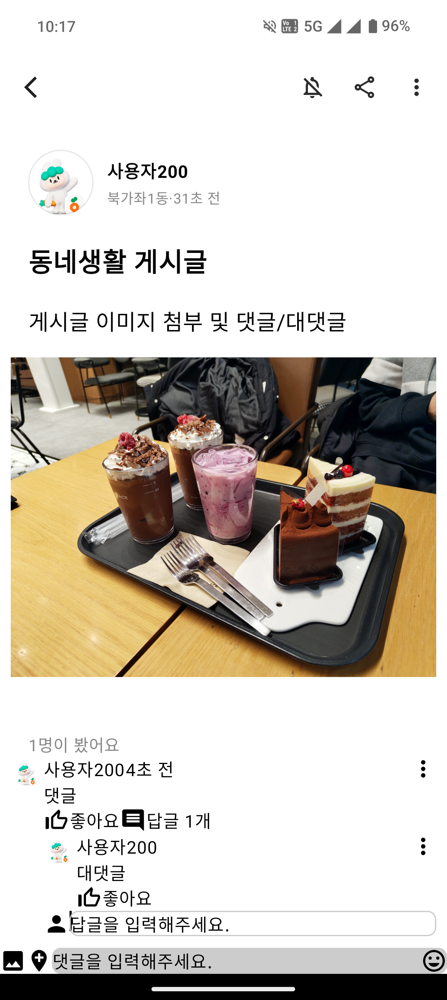

### 3.2. 동네생활 게시글 작성

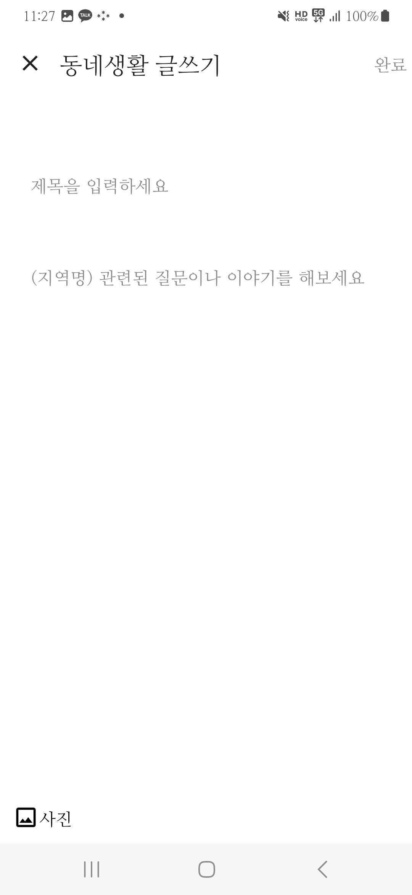

### 3.3. 동네생활 댓글, 대댓글

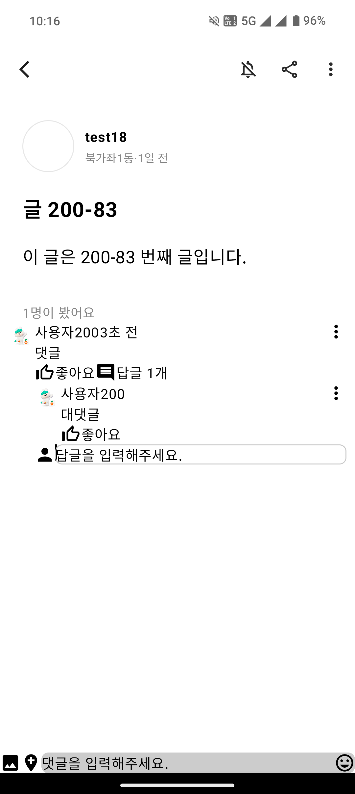

## 4. 채팅

### 4.1. 채팅 목록 / 상세 화면

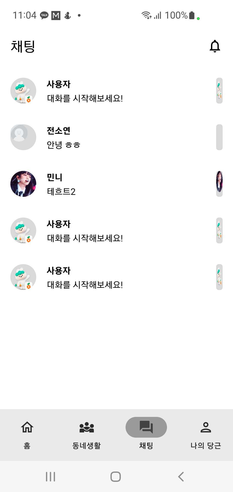
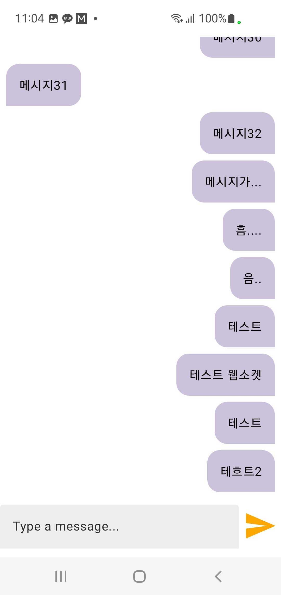

## 5. 나의 당근

### 5.1. 나의 당근 메인 화면

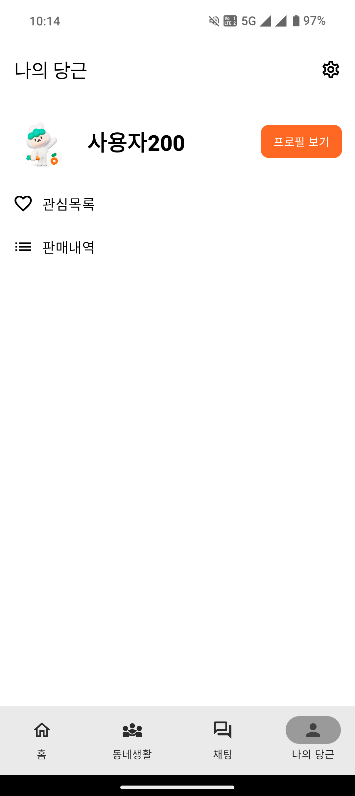

### 5.2. 사용자 프로필 조회 / 수정 화면

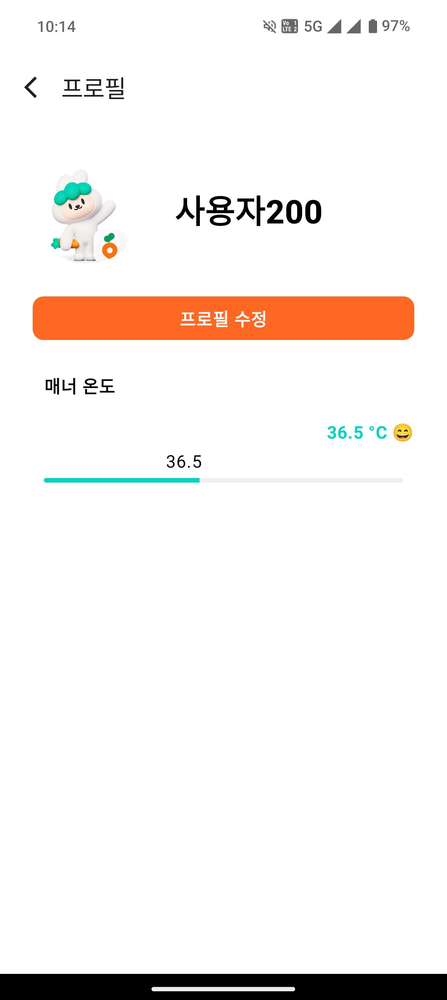
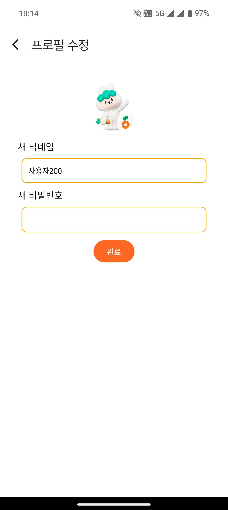

### 5.3. 관심 목록 / 판매 내역 화면

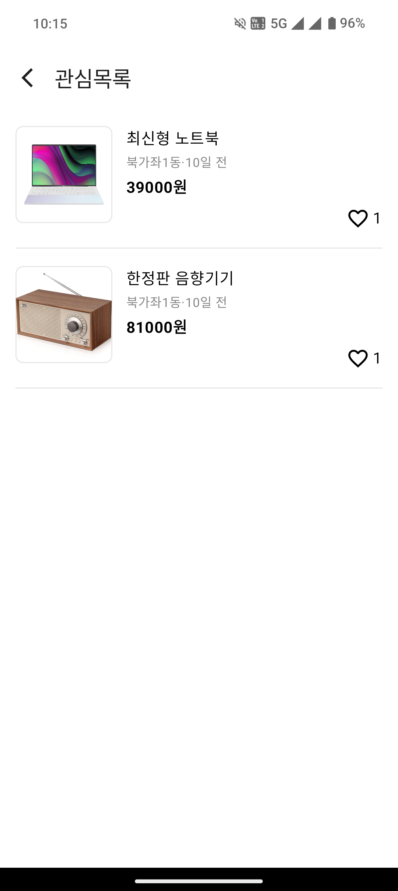


# II. 서비스 아키텍처

## 1. 서비스 구조

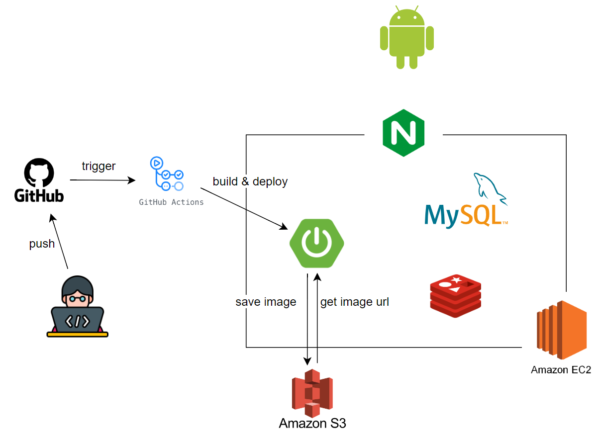

## 2. ERD

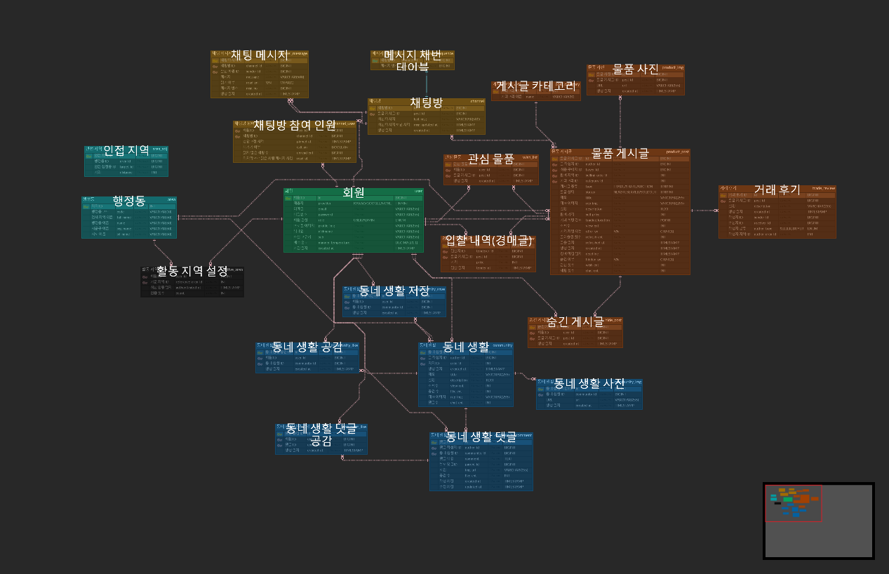

# III. 협업 방식

## 1. Notion

### 1.1. 스프린트 보드


### 1.2. [API 기능 명세](https://www.notion.so/API-ad4f747177c34df18ba3d85b5224a771?pvs=21)

- 아래와 같은 목적으로 작성
    - 구현할 API 식별
    - API 구현 진행 상황 파악
    - 백엔드 - 클라이언트 소통
- API 명세 목록


- API 명세 예시


## 2. Git

- 커밋 컨벤션
    
    ```css
    # 제목은 최대 50글자까지 아래에 작성
    # 한 줄 띄우기
    # 본문은 아래에 작성  
    # 한 줄 띄우기
    # 꼬릿말은 아래에 작성  
    
    # --- COMMIT END ---  
    #   <type> 리스트  
    #   feat        : 기능 (새로운 기능)  
    #   fix         : 버그 (버그 수정)  
    #   refactor    : 리팩토링  
    #   design      : CSS 등 사용자 UI 디자인 변경  
    #   comment     : 필요한 주석 추가 및 변경  
    #   style       : 스타일 (코드 형식, 세미콜론 추가: 비즈니스 로직에 변경 없음)  
    #   docs        : 문서 수정 (문서 추가, 수정, 삭제, README)  
    #   test        : 테스트 (테스트 코드 추가, 수정, 삭제: 비즈니스 로직에 변경 없음)  
    #   chore       : 기타 변경사항 (빌드 스크립트 수정, assets, 패키지 매니저 등)  
    #   init        : 초기 생성  
    #   rename      : 파일 혹은 폴더명을 수정하거나 옮기는 작업만 한 경우  
    #   remove      : 파일을 삭제하는 작업만 수행한 경우  
    # ------------------  
    #   제목 첫 글자를 대문자로  
    #   제목은 명령문으로  
    #   제목 끝에 마침표(.) 금지  
    #   제목과 본문을 한 줄 띄워 분리하기  
    #   본문은 "어떻게" 보다 "무엇을", "왜"를 설명한다.  
    #   본문에 여러줄의 메시지를 작성할 땐 "-"로 구분  
    # ------------------  
    #   <footer-type>  
    #   필수가 아닌 optional  
    #   Fixes        :이슈 수정중 (아직 해결되지 않은 경우)  
    #   Resolves     : 이슈 해결했을 때 사용  
    #   Ref          : 참고할 이슈가 있을 때 사용  
    #   Related      : 해당 커밋에 관련된 이슈번호 (아직 해결되지 않은 경우)  
    ```
    
- 커밋 메시지 (예시)
    
    ```markdown
    [TSK-123] Feat: Add signin, signup // [<ticketID>] <type>: <subject>
      
    회원가입 기능, 로그인 기능 추가(예시를 위해 간단히 작성) // <body>
    
    Related: TSK-122 // <footer-type>: <ticketID> --- optional
    ```
    
- feature 브랜치 네이밍 : `feature-<관련기능이름>`

## 3. Slack

- 일일 스크럼

    
    
    - 매일 통합, 백엔드, 안드로이드 스크럼 스레드를 이용해 그 날 발생한 이슈들에 대하여 논의
- 주간 회의
    - 팀 스크럼 회의 (월요일 밤 10시, 토요일 점심)
        
        : 허들, 오프라인 회의 등을 통해 지금까지의 진행 상황, 발생한 이슈를 공유하고 다음 주에 할 일을 계획